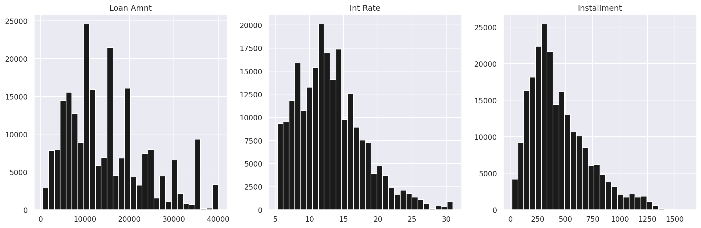
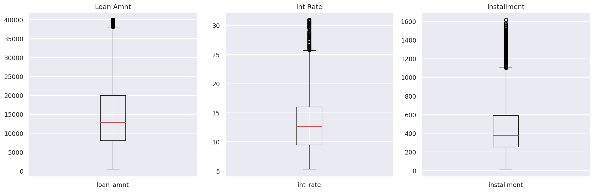
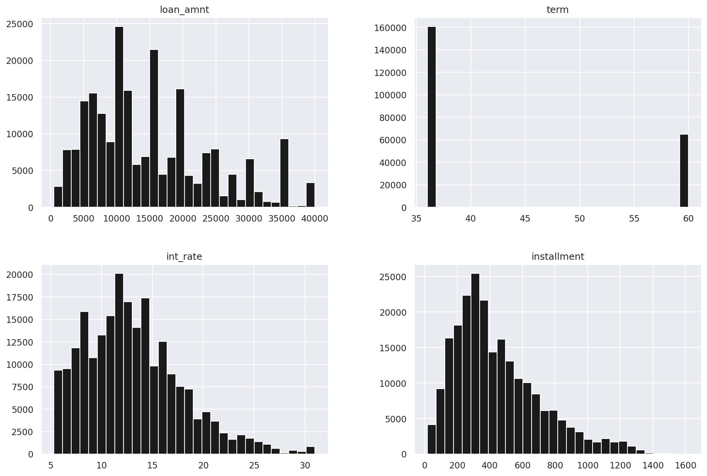

# PySpark Analysis Project

Проект для аналізу та очищення даних LendingClub з використанням Apache Spark.

## Використання

**Запуск:**

```bash
# Запустити контейнер (перший раз)
docker-compose up --build -d

# Запустити контейнер (наступні рази)
docker-compose up -d

# Виконати пайплайн обробки даних
docker exec -it pyspark_app python3 -m src.dataset.process
```

**Зупинка:**

```bash
docker-compose down
```

**Інтерактивна робота:**

```bash
docker exec -it pyspark_app bash
```

**Перебудувати після змін в Dockerfile:**

```bash
docker-compose up --build -d
```

## Структура

```
├── data/                          # Дані (монтується в /app/data)
│   ├── big_data.csv               # Вхідний датасет (завантажується автоматично)
│   ├── cleaned-data/       	   # Spark part-файли
│   ├── cleaned_data_merged.csv    # Об'єднаний очищений датасет
│   └── visualizations/            # Збережені графіки
├── src/
│   ├── main.py
│   ├── dataset/                   # Модуль обробки даних
│   │   ├── spark_session.py       # Ініціалізація Spark
│   │   ├── loader.py              # Завантаження даних
│   │   ├── cleaner.py             # Очищення даних
│   │   ├── visualizer.py          # Візуалізація
│   │   ├── exporter.py            # Експорт даних
│   │   ├── merger.py              # Об'єднання part-файлів
│   │   └── process.py             # Головний пайплайн
│   ├── questions/                 # Аналітичні запити
│   └── utils/                     # Допоміжні функції
├── docker-compose.yml
├── Dockerfile
└── pyproject.toml                 # Залежності проекту
```

## Як працює обробка даних

Пайплайн обробки даних складається з кількох етапів:

### 1. Завантаження даних
Датасет LendingClub автоматично завантажується з Google Drive при першому запуску. Файл зберігається локально в `data/big_data.csv`, тому при повторних запусках завантаження не відбувається.

### 2. Очищення даних
Це основний етап, де ми приводимо "сирі" дані до нормального вигляду:

- **Видалення зайвих колонок** — прибираємо `id`, `member_id`, `grade` та інші, які не потрібні для аналізу
- **Видалення колонок з пропусками** — якщо в колонці більше 30% значень відсутні, вона видаляється
- **Заповнення пропусків** — числові колонки заповнюються середнім значенням
- **Обробка FICO скорів** — рядки без FICO скорів видаляються (це важливі дані)
- **Перетворення колонки `term`** — прибираємо " months" і конвертуємо в число
- **One-Hot Encoding для `home_ownership`** — категоріальну змінну розбиваємо на окремі колонки
- **Кодування прапорців** — `hardship_flag` та `debt_settlement_flag` перетворюємо з Y/N в 1/0

### 3. Візуалізація
Після очищення генеруються графіки для аналізу розподілу даних:

**Гістограми основних показників** — показують як розподілені суми кредитів, процентні ставки та щомісячні платежі. Можна побачити, які суми кредитів найпопулярніші та який діапазон ставок переважає.



**Боксплоти основних показників** — допомагають виявити викиди (аномальні значення) та зрозуміти медіанні значення. Якщо бачимо багато точок за межами "вусів" — це потенційні викиди.



**Гістограми підмножини колонок** — загальний огляд розподілу перших 18 числових колонок датасету. Дає швидке уявлення про характер даних в цілому.



### 4. Експорт
Очищені дані зберігаються у двох форматах:
- `data/cleaned-data/` — Spark part-файли (для подальшої роботи зі Spark)
- `data/cleaned_data_merged.csv` — єдиний CSV файл (зручно для перегляду та аналізу)
